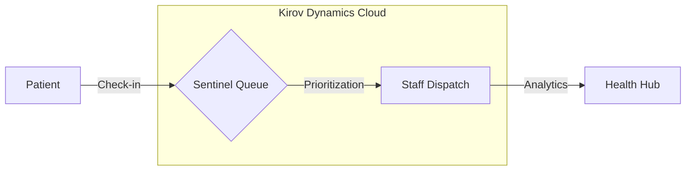

# 🏥 KIROV DYNAMICS | HEALTH QUEUE SENTINEL
### Autonomous Healthcare Flow Orchestration

---

## 🚀 Overview

**Health Queue Sentinel** is a sovereign digital queue management engine designed by **Kirov Dynamics Technology** to ensure equitable healthcare access. It streamlines patient flow, eliminates manual bottlenecks, and provides real-time observability into clinical operations.

> **"Sovereign Flow for Equitable Healthcare."**

---

## 🏗️ Architecture: Sentinel Orchestrator

---

## ✨ Features

- **🎯 Real-Time Queue Management**: Doctors and admins can track waiting, in-consultation, and completed patients with dynamic updates.
- **📱 Mobile-First Design**: Fully responsive interface optimized for clinical environments.
- **🇿🇦 Localized Impact**: Tailored for South African healthcare facilities.
- **⚡ High Intelligence**: Driven by Kirov Dynamics autonomous orchestration.

---

## 🛠️ Tech Stack (Modernized)

- **Frontend**: SvelteKit 2.0 (High Performance)
- **Styling**: Vanilla CSS (Hardened)
- **Observability**: Kirov Health Hub
- **Deployment**: Vercel Sovereign

---

## 👥 Contributors
- **Raphasha27** (Lead Architect & Sovereign Engineer)

---

© 2026 **Kirov Dynamics Technology** | Developed by **Raphasha27**
